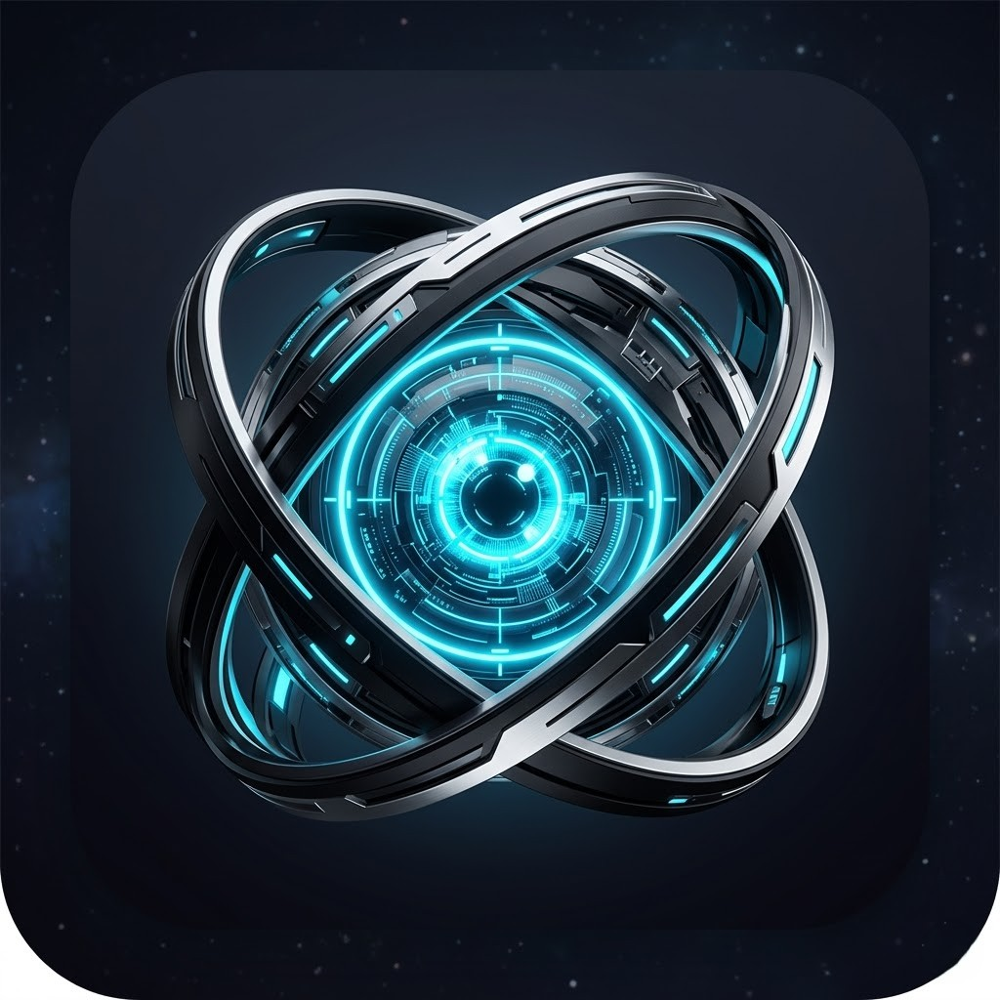

  
  <h1>KAIRO Smart Ecosystem</h1>
  
<b>Advanced AI-Powered Network Architecture & IoT Hub</b>

  
  
  
  

## 🚀 Overview
**KAIRO** is a proprietary, next-generation smart ecosystem that seamlessly integrates artificial intelligence, IoT hardware, and secure cloud networking. Developed by **Avantrix Solutions**, KAIRO acts as a centralized cognitive brain to control, monitor, and automate complex tasks across various physical devices and digital platforms.

> **Note:** *This repository serves as a public showcase of the product's architecture and capabilities. The core source code, AI orchestration logic, and database schemas are kept strictly private to protect intellectual property.*

---

## 🌟 Key Features

* 🧠 **Cognitive AI Core:** Processes natural language commands (Dual Language capabilities) to execute complex, multi-step automated workflows.
* 🔒 **Zero-Trust Security:** Utilizes encrypted mesh networking and secure endpoints to ensure local hardware access remains impenetrable from outside threats.
* 🎙️ **Voice Satellite Hub:** Custom-engineered smart speaker with real-time audio visualization for hands-free ecosystem control.
* 🔌 **Edge IoT Integration:** Seamlessly communicates with embedded hardware (Microcontrollers/Sensors) for low-latency physical environment control.
* 📱 **Unified Control Interface:** A sleek mobile/web dashboard offering real-time data monitoring, device status, and manual overrides.

---

## 🧠 System Architecture

KAIRO is built on a highly modular and secure network:
* **KAIRO Brain (n8n + Gemini AI):** The cognitive core processing natural language and automating workflows.
* **App Control:** A sleek, user-friendly mobile interface for total ecosystem management.
* **Supabase Memory:** Scalable, real-time cloud database acting as the system's long-term memory.
* **Tailscale Security Tunnel:** A secure, zero-trust network linking the cloud brain to local PCs.
* **Voice Satellite:** An intelligent audio interface for voice commands and feedback.

---

## 🛠️ Hardware Prototyping
KAIRO extends beyond software into the physical world to provide a true smart environment experience.

### 1. Voice Assistant Satellite

A custom-designed hardware interface with a built-in microphone array, NeoPixel status rings, and an LCD screen for visual feedback. 

### 2. Microcontroller Core (MCU)

The underlying physical layer utilizing advanced microcontrollers to handle sensor data processing, local automation, and device triggering.

---

## 📱 The Unified Control Interface

Kairo is managed through a sleek, intuitive mobile control dashboard This interface provides total transparency and control over the entire ecosystem:
1. **Central Dashboard:** Real-time system health, Zero-Trust network status, and an instant 'Ask Kairo' voice command input.
2. **Device Hub:** Direct control over connected hardware like the Voice Satellite (volume, LED colors) and IoT sensors, plus status monitoring for remote endpoints.
3. **AI Insights & Memory:** View recent automated actions, contextual recalls from Supabase memory, and AI-driven system optimizations.

## 🎯 Primary Use Cases
- **Smart Home Automation:** Adaptive lighting, climate control, and security management based on predictive AI.
- **Remote Workspace Management:** Securely accessing and automating tasks on remote work PCs without exposing them to the public internet.
- **Enterprise Operations:** Centralized monitoring of hardware health and automated report generation via AI.

---

## 🗺️ Future Roadmap
- [x] Initial Architecture & Cloud Orchestration Setup
- [x] Mobile Control Dashboard Integration
- [x] Voice Satellite Hardware Prototyping
- [ ] Predictive Analytics for Power Consumption
- [ ] Expansion to Wearable Stress & Health Monitoring APIs

---

## 💼 Developed by Avantrix Solutions
**KAIRO** is a flagship commercial product designed and engineered by **Avantrix Solutions**. We specialize in bringing cutting-edge AI integration, custom software architecture, and hardware solutions to life.

🌐 **Website:** [https://avantrix.tech](https://avantrix.tech)
📧 **Contact For Business Inquiries:** avantrix@gmail.com

  <i>Empowering the future through intelligent automation.</i>

